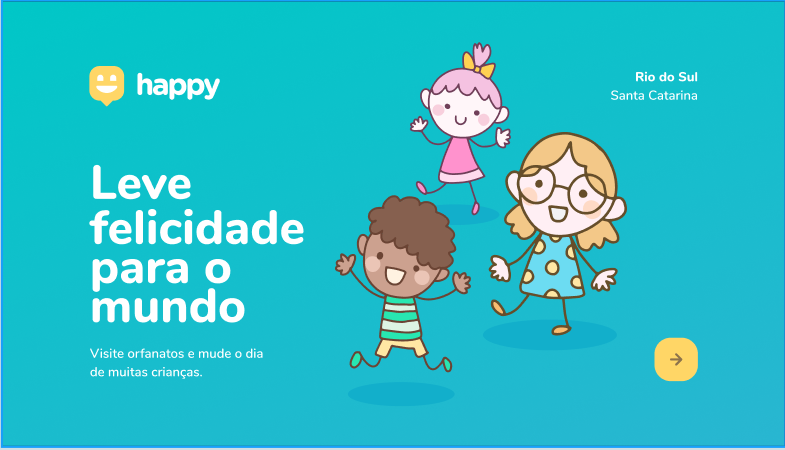

# Projeto Happy by RocketSeat 🚀

*Projeto:*

O projeto Happy é uma forma de poder encontrar locais de adoção que aceitem visitas, assim você podendo saber qual é local mais proximo para você fazer visita para uma dessas crianças e alegrar o dia delas

# Happy

*Tecnologias usadas* 💻

- handlebars (Template engine)

- Html 5
- Css3
- JavaScript
- NodeJs
- Express
- Sql
- Figma

🐱‍💻 *Projeto feito por AlanPoveda*

*Redes Sociais*

[Linkedin](https://www.linkedin.com/in/alan-poveda-a8a4b7b5/)
[Twitter](https://twitter.com/AlanPoveda)